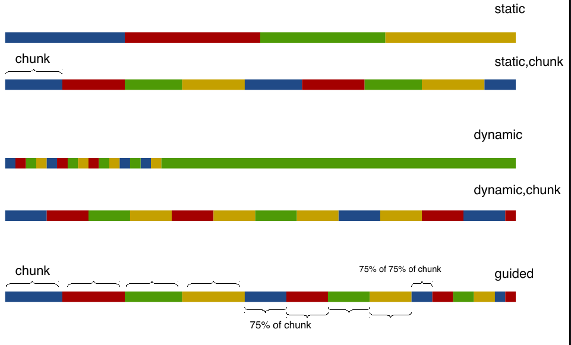

# Contador ciclico de numeros primos
Creado por Fabiola Jimenez y Karen Zamora.

El siguiente cuadro muestra los tiempos de duracion para diferentes estrategias de scheduling y diferentes tamanos de chunks. Los tiempos estan dados en milisegundos. El procesador de pruebas que se utilizo corria por deafult con 4 hilos.

|  tipo |  1 |  4 |  2 | 50 000 000 |
|---|---|---|---|---|
|  static | 188 005.68  | 180 284.62   | 182 387.16   |  123 466.05  | 
| dynamic  | 187 799.01  | 181 877.66    | 182 279.16 |  116 909.45   |
| guided  | 188 096.01  | 181 266.22  | 183 416.84  | 124 792.51  |

El tiempo de duracion del programa serial fue de 144 912, 98 y del paralelo simple 165 432, 77.

#### Cual tuvo menor duracion y por que

Parece que el tipo de scheduling con menor tiempo de duracion fue el dinamico con tamanos de chunk grandes, esto puesto que la manera en la que se distribuyen los chunks de manera dinamica son mas eficientes y porque al tener tamanos de chunks mas grandes el programa no tiene que estar distribuyendo iteraciones, parece que esto afecta el rendimiento. 

#### Scheduling guiado y ejemplo

En el scheduling guiado las iteraciones se asignan a los hilos conforme las van solicitando. El tamano del chunk es proporcional al numero de iteraciones no asignadas, dividido entre el numero de hilos menos 1. Esto hace que progresivamente cada chunk que se distribuya sea mas pequeno que el anterior.

#### Ejemplo:
Por ejemplo si tenemos 10 iteraciones y 2 hilos, el tamano del primer chunk sera de 4, luego de 1.
Tal y como se muestra en la siguiente imagen se da la asignacion de chunks segun el tipo de scheduling.

