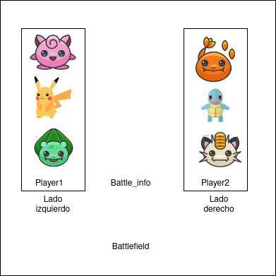

# ¡Bienvenidos a nuestro proyecto! Este es un simulador de batallas Pokémon
### Integrantes: Karen Zamora y Fabiola Jiménez

La idea es que se simule un campo de batalla en el cual cada jugador tiene 3 pokemones, en cada campo de batalla hay dos jugadores. Los pokemones pelean entre sí hasta que uno se debilite, y se van rotando.
El jugador el cual sus tres pokemones se debiliten de primero, pierde.


### Manual de usuario
Para compilar el compilar el codigo fuente basta con clonar el repositorio y escribir make en la carpeta guardada, el Makefile incluido compilara los archivos.

Para el caso de la carpeta con interfaz grafica, se necesita la instalacion de la libreria GTK para correr la interfaz grafica, para mas informacion sobre el uso de esta visitar la informacion siguiente:

GTK+ Tutorial - https://developer.gnome.org/gtk3/stable/gtk-getting-started.html

Una vez compilado el archivo basta ejecutar `./pokemon ` en la terminal para iniciar el programa.

Para iniciar la batalla el codigo fuente le solicitara insertar los IDs de 3 pokemones, para cada jugador, en consola debera insertar los 3 ids, en la interfaz grafica escribirlos en los tres campos disponibles. 

La lista de pokemones y sus ids es la siguiente:
|id-pokemon|
|-----------|
|0 - venusaur|
|1 - wigglytuff|
|2 - gloom|
|3 - primeape|
|4 - machamp|
|5 - victreebel|
|6 - dewgong|
|7 - lickitung|
|8 - lapras|
|9 - snorlax|
|10 - zapdos|
|11 - mew|
|12 - meganium|
|13 - lanturn|
|14 - bellossom|
|15 - azumarill|
|16 - politoed|
|17 - umbreon|
|18 - mantine|
|19 - skarmory|
|20 - hitmontop|
|21 - raikou |
|22 - swampert|
|23 - shiftry|
|24 - pelipper|
|25 - vigoroth|
|26 - medicham|
|27 - flygon|
|28 - altaria|
|29 - whiscash|
|30 - castform|
|31 - tropius|
|32 - regirock|
|33 - registeel|
|34 - deoxys|
|35 - grotle|
|36 - bastiodon|
|37 - munchlax|
|38 - abomasnow|
|39 - magnezone|
|40 - cresselia|
|41 - leavanny|
|42 - whimsicott|
|43 - scrafty|
|44 - alomomola|
|45 - galvantula|
|46 - ferrothorn|
|47 - stunfisk|
|48 - zweilous|
|49 - obstagoon|

El programa al final imprime la duracion de cada pokemon en el campo de batalla, la duracion de la batalla y el jugador ganador.

### Detalles de la solución

Las carpetas se encuentran acomodadas de la siguiente manera:
```
├──README.md
├──pokemon
|     ├── controller
|     |     ├── referee.c
|     |     ├── battle_field.c
|     |     ├── mapper.c
|     |     ├──pokemon.c
|     |     └──player.c
|     ├──Model
|     |     ├── referee.h
|     |     ├── battle_field.h
|     |     ├── mapper.h
|     |     ├── pokemon.h
|     |     └──player.h
|     └──  Makefile
└── pokemon_ui
      ├── controller
      |     ├── referee.c
      |     ├── battle_field.c
      |     ├── mapper.c
      |     ├──pokemon.c
      |     └──player.c
      ├──Model
      |     ├── referee.h
      |     ├── battle_field.h
      |     ├── mapper.h
      |     ├── pokemon.h
      |     └──player.h
      ├── view
      |     └── pokemon.ui
      └──  Makefile
```
La primera carpeta pokemon corre el programa sin la interfaz grafica, la segunda lo corre con la interfaz grafica.

#### Referee
Es quien se encarga de controlar todo lo que pasa, contiene el main y metodos auxiliares para tomar el tiempo y mostrar las estadisticas, es quien crea todas las estructuras de datos. Referee crea el tipo de datos walltime_t que es quien se utiliza para almacenar la duracion de cada hilo en el campo de batalla.

#### Battle_field
Battlefield se encarga de mantener las estructuras de datos e informacion globales, el battlefield de cada batalla es global.

Battlefield crea tres tipos de datos:
1. battle_field, que contiene los dos lados y dos estructuras de datos de control. 
2. battle_info, que contiene la informacion de ataques y demas de la batalla.
3. side_t que corresponden a los lados del campo de batalla, cada lado, izquierdo y derecho contienen a un jugador.

#### Mapper
Mapper es quien se encarga de dar toda la informacion de los pokemones para su creacion: su tipo, dano, efectividad, debilidades, vulnerabilidades, etc.

#### Pokemon
Pokemon es quien realiza todas las acciones y contiene toda la informacion relacionada a cada pokemon, se encarga de pelear y conocer sus propios atributos, como cuando esta debil. Tambien se encarga de despertar a los pokemones siguientes que deben pelear.
Pokemon crea cinco tipos de datos:
1. charged_move, que contiene la informacion relacionada a los ataques cargados: id, cooldown, nombre, energia y tipo.
2. fast_move, que contiene la informacion relacionada a los ataques rapidos: id, cooldown, nombre, energia y tipo.
3. type_t que contiene la informacion del id del tipo de ataque, y el nombre
4. pokemon_t que contiene toda la informacion del pokemon, nombre, id, ataques, tiempo de duracion en batalla, oponente, entre otras.
5. pokemon_data_t que contiene informacion compartida entre pokemones: un puntero al pokemon, a los lados, y un barrier que hace que se esperen entre hilos.

#### Player
Jugador es quien contiene la informacion de su arreglo de pokemones, su id y su posicion en el juego al finalizar.
Player puede elegir su equipo, y determinar si su equipo esta debil.
Player crea su tipo player_t que se encuentra contenido en cada lado de battlefield, contiene un puntero de punteros a sus pokemones, su id y posicion en el juego.

#### View
Se encarga de controlar la interfaz grafica.



La creacion y destruccion de elementos y estructuras de datos la hace referee, quien es quien los controla a todos, los pokemones estan contenidos dentro de cada player y player a su vez se encuentra colocado en un lado del battlefield, de esta manera interaccionan.


### Métodos de sincronización
1. Se utilizo una barrera de manera que los pokemones se esperen para iniciar la batalla.
2. Se implemento un arreglo de mutexes para cada lado del battlefield, de manera que estos despierten en el orden de seleccion del jugador.
3. Se implementaron dos mutexes para la modificacion y lectura de la salud de cada jugador, y ademas para la lectura de la variable equipoRocket, la cual se activaba cuando el equipo oponente estaba sin vida, puesto que observabamos segmentation fault cuando algun hilo intentaba acceder a estas estructuras mientras otro estaba escribiendo.


