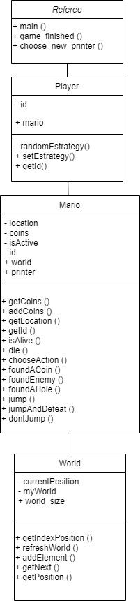

# ¡Bienvenidos a nuestro proyecto! Este es un simulador de Super Mario Battle Royale.
### Integrantes: Karen Zamora y Fabiola Jiménez

### _______________________________________________________________________________


### Detalles de la solución
En este emocionante juego usted podrá seguir el recorrido de un Mario mientras enfrenta peligrosos obstáculos en el clásico mundo 1-1, como little Goombas, Koopa Troopas y hoyos, y además debe de cuidarse de otros Marios que lo quieran sabotear. Todo esto mientras busca aumentar su fortuna y llegar a la gloria como el último Mario en pie.

### Manual de usuario

- Para iniciar es necesario que instale en su ambiente linux open-mpi o mpich para poder hacer uso de mpi
- Para compilar el código fuente deberá clonar el repositorio, ubicarse en la carpeta que contiene los archivos y en la consola escribir make, el Makefile incluido compilará los archivos.
- Una vez compilados los archivos, deberá ejecutar este comando: 
```mpiexec -n # ./super_mario_mpi ``` (donde deberá sustituir el # por el número de Marios que desea crear, este número debe ser entre 3 y 35).
Y en caso de tener problemas con este comando puede probar con este otro: ```mpiexec -n # --oversubscribe ./super_mario_mpi```

Al iniciarse el programa le solicitará que escoja una estrategia para manejar los enemigos derrotados, siendo las opciones:

1. Aleatoria: el Mario seleccionado elegirá al azar a otro Mario para enviarle a su mundo los enemigos derrotados
2. Menos monedas: el Mario seleccionado enviará los enemigos derrotados al mundo del Mario que tenga la menor cantidad de monedas
3. Más monedas: el Mario seleccionado enviará los enemigos derrotados al mundo del Mario que tenga la mayor cantidad de monedas
4. Atacante: el Mario seleccionado buscará vengarse de uno de los Marios que lo estén atacando y le enviará los enemigos derrotados a su mundo

Posteriormente se le solicitará escoger un número de Mario para seguir su recorrido en pantalla, en caso de que el Mario elegido muera sin haber terminado el juego, se le solicitará escoger un nuevo Mario de los restantes. Importante!, el número escogido debe estar dentro del rango de la cantidad de Marios elegida al ejecutar el programa.

Al hacer esto podrá observar en pantalla la información del Mario elegido conforme avanza, se mostrará:
La posición del mundo en la que se encuentra Mario, su número, la cantidad de monedas que tiene, hacia quién van dirigidos sus ataques, quién lo está atacando, su estrategia de ataque, la cantidad de Marios que se encuentran con vida y la indicación del fin del juego en caso de que este termine, junto con el jugador ganador.

### Detalles de la solución

Se muestra un diagrama de clases para representar la relación entre las clases.



### Referee
Es el encargado de la lógica principal del juego, crea a cada uno de los jugadores y verifica las acciones a realizar producto de la interación de Mario con cada uno de los elementos del mundo y con base en esto calcula de acerdo a la estrategia elegida a quién atacar. Además, debe verificar los jugadores que hayan muerto e indicar cuándo ha finalido el juego.
Es tambien quien contiene toda la logica de sincronizacion de procesos.

### Player
Cada jugador representa a cada uno de los procesos(exceptuando al 0, quién tendrá otras funciones), cada uno de estos cuenta con un Mario y una estrategia. Esta última será asignada de forma al azar, excepto en el caso del Mario elegido por el usuario, cuya estrategia será la elegida por este.

### Mario
Contiene los atributos que caracterizan a un Mario, entre ellos su mundo. Además, de las acciones que debe realizar al interactuar con cada uno de los elementos, para lo cuál realiza un cálculo basado en probabilidades de si debe saltar y seguir, saltar y matar a su enemigo o no saltar y morir. 

### World
Es una representación del clásico mundo 1-1 de Mario, donde se encuentran diversos elementos a lo largo de su camino, entre ellos enemigos como little Goombas y Koopa Troopas, obtáculos como hoyos en medio del camino y recompensas como monedas. El Mario caminará por este mundo sorteando obstáculos hasta llegar a la bandera ubicada en el final, dónde deberá de regresar al inicio del mundo.

Las carpetas se encuentran acomodadas de la siguiente manera:
```

├──assets/ (Contiene las imágenes presentadas en este README)
├──README.md
├── Makefile (archivo que compila el proyecto)
├── Mario.h (Header de Mario)
├── Mario.cpp (Implementacion de metodos de Mario)
├── Player.h (Header de jugador)
├── Player.cpp (Implementacion de metodos de jugador)
├── world.h (Header del mundo)
├── world.cpp (Implementacion de metodos del mundo)
└── referee.cpp (Contiene el main y la sincronizacion)
```
### MPI
 
 En este apartado se enlistan y describen las funciones de mpi utilizadas:
 
 * MPI_Bcast: Se utilizó Broadcasts para comunicar las variables de control que solo el proceso 0 conocía, enviando así la información del proceso 0 a los demás. Se utilizó para comunicar lo que se recibía de consola: quién sería el printer y su estrategia, tanto al inicio como en el caso de que el impresor muriera. Además, puesto que el proceso cero se encargaba de determinar si el juego ya había finalizado (cuando solo quedaba un jugador vivo) utilizamos un broadcast para comunicar esta variable de control ```finished ``` a los demás procesos. 
 
 * MPI_Allgather: El método de AllGather se utilizó para que todos los procesos obtuvieran información relevante de la ejecución del programa. Las variables que se compartieron a través de este comunicador fueron: las monedas de cada proceso, quién era su enemigo y si estaba vivo o no. Estas se guardaban en un arreglo accesible a todos, y con base en esta información se imprimía en consola y se determinaba a quién atacar según la estrategia. Además se utilizó para determinar cuántos goombas o koopatroopas fueron enviados a cada proceso, mediante la recopilación de los goombas que acumuló su proceso y determinando al enemigo que se los iba a enviar.Así cada proceso determinaba cuántos Little Goombas o cuántos KoopaTroopas debía agregar a su mundo.
 
 * MPI_Gather: Este comunicador lo utilizó unicamente el proceso impresor para recibir un arreglo de jugadores vivos, de manera que pudiera imprimir la cantidad de Marios que aún seguían vivos en el juego.

